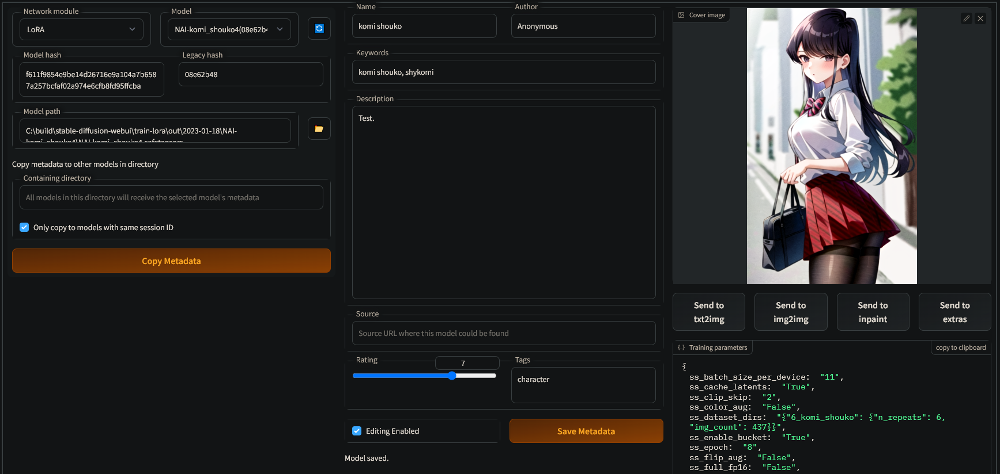

# Model Metadata Editor for stable-diffusion-webui

This extension for [stable-diffusion-webui](https://github.com/AUTOMATIC1111/stable-diffusion-webui) allows you to embed user-specified metadata like description, tags and rating into compatible Stable Diffusion model files (currently LoRAs created by [sd-scripts](https://github.com/kohya-ss/sd-scripts)).

## Installation

Install this extension with the `Install from URL` tab under the `Extensions` tab in stable-diffusion-webui, passing the repository URL (https://github.com/space-nuko/sd-webui-model-metadata-editor).

## Usage

First, be sure to configure the paths to your model files in the `Model Metadata Editor` section of the webui settings. (**Note:** The models must be in `.safetensors` format to save metadata.)

Switch to the `Model Metadata Editor` tab and click the refresh button to get the list of models.

Select a model from the list, then check `Enable Editing` near the bottom of the page. Fill in the details of the model you wish to edit. You can provide an optional cover image by dragging and dropping it onto the image widget on the page.
 
When finished, click `Save Metadata`. By default, a backup of the model file will be created before saving if it doesn't exist yet.

If you have several models from the same session with different epochs, you can use the `Copy metadata to other models in directory` feature to the left to duplicate the current model's metadata to the other models. By default, only models from the same training session will be targeted. Uncheck the `Only copy to models with same session ID` checkbox to copy to all models in the same folder regardless of what session they came from. Note that session IDs are only recorded for models trained with a recent version of sd-scripts (after [this commit](https://github.com/kohya-ss/sd-scripts/commit/7dbcef745a822b64b0407e193985e7ba96c8de0e)), so for older models you may have to uncheck this box for the feature to work.
